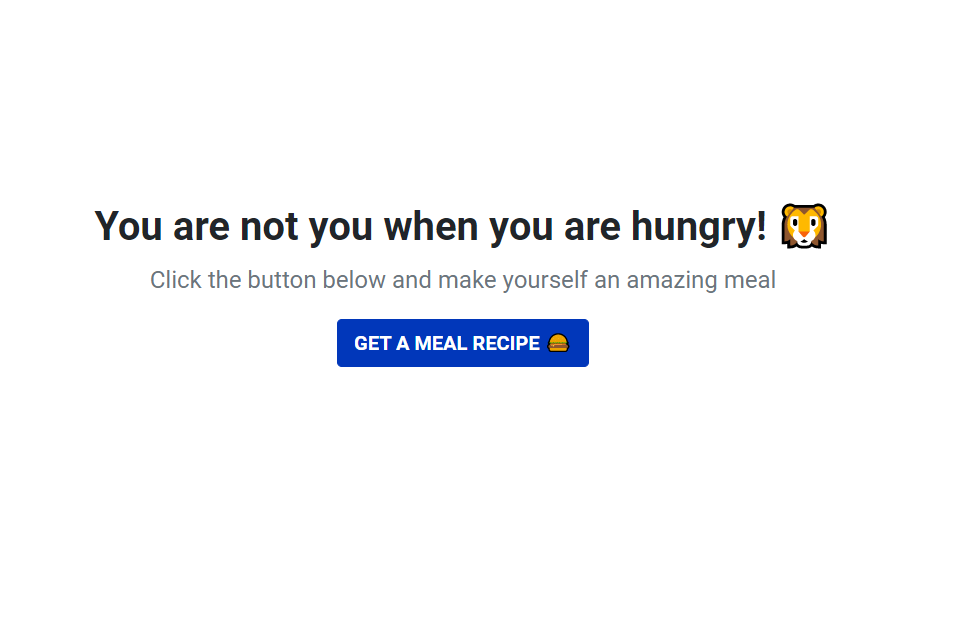

## 🍔 Random Meal Recipe
Just a fun project that fetches a random recipe from an API and displays it. The goal for this project was simply to test a few thing and work with different libraries such as axios for making AJAX calls.



## 🚀 Technologies used
- Parcel
- Bootstrap 5 
- Spin.js
- Axios
- Fontawesome

## ▶️ Quick preview
You can check out the app here:
<a href="https://random-recipe-app.netlify.app/" target="_blank">Random Meal Recipe</a> 
(WARNING: Opens in the same tab)

## ✅ Setup 
Tp run this project install it locally using npm:
```
$ git clone https://github.com/dimitarradulov/random-recipe.git
$ cd random-recipe
$ npm install
$ npm run dev
```
